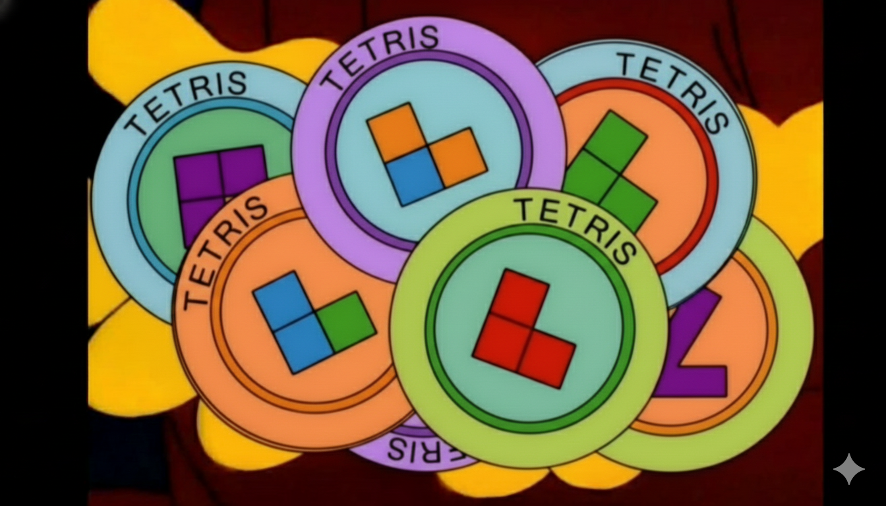

## 👾 Silver.dev's Tetris Galore

*El tetris volvió... en forma de tokens*

Welcome to our company! You've just joined the team and are in charge of fixing a key product: the Tetris game. This game was developed by an engineer who happens to be on PTO, so you'll have to onboard yourself to the project.

Here you'll find the urgent backlog of the game:
1. The bugs are P0, and *all* must be solved
2. Then, you should implement the pending refactor
3. To finish off strong, you should pick a missing feature and implement it

The following tickets are a mix of urgent issues and high priority ideas. Not all of them are described thoroughly, as we're yet to hire a PM. You'll have to read the issues, play the game, and diagnose the core issues to properly work on the tasks.

### 🐞 Bugs

#### \[SIL-1] - fix: some users can't rotate pieces

It's been reported that some users cannot rotate the tetris pieces and our metrics show that this is a major cause of churn, specially for new ones. This doesn't seem to be a problem for users that have had at least 1 session with us. Diagnose and fix!

#### \[SIL-2] - fix: level state leak?

During a game, one should progress 1 level every 10 lines. Some users report that this isn't always true and some levels seem to skip this rule. Make sure that this level-up rule is implemented properly: level up every 10 cleared lines, speed up game every level, score more points every level, Level 1 means 0 cleared lines.

### ⚙️ Refactors

#### \[SIL-3] refactor: game pacing is too slow

10 cleared lines per level isn't as engaging as it could be. Reduce the amount of cleared lines required from 10 to 5.

#### \[SIL-4] refactor: simplify tetrominoes

The working implementation of the tetris pieces (a.k.a tetrominoes) is over-engineered: hard to read, and could be the source of future bugs. Simplify this section (see line 5 in `src/App.tsx`) so that:
1. Every map entry points to just 1 shape declaration
2. Every shape declaration has minimal zero-based padding and only uses four 1 characters (e.g `I: [[1,1,1,1]]`, `T: [[1,1,1],[0,1,0]]`)

This will probably require modifying the rotation logic in the game, too.

### 🧪 Features

#### \[SIL-5] feat: mouse playing

Enable full mouse-centered experience: you should be able to play with the mouse as you do with the keyboard. 

#### \[SIL-6] feat: display future tetrominoes

Generate and enqueue future tetrominoes, then display them for the player alongside the main board.
